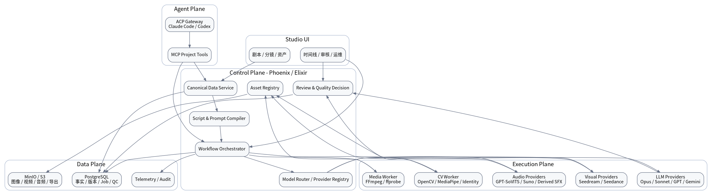
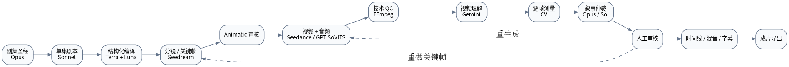

# 3. 系统架构设计

## 3.1 总体分层

系统分为五个平面：

1. **Studio UI**：剧本、分镜、资产、时间线、审核和运维工作台。
2. **Control Plane**：领域数据、编译、工作流、路由、审核和权限。
3. **Execution Plane**：模型 Provider、媒体 Worker、CV Worker 和本地推理服务。
4. **Data Plane**：PostgreSQL、对象存储、缓存和日志指标。
5. **Agent Plane**：Claude/Codex 交互式 Agent、ACP Gateway 和 MCP 工具。



## 3.2 前端工作台

建议技术：**Vue 3 + TypeScript + Vite**。

主要模块：

- 项目与剧集圣经；
- 角色、服装、场景、道具资产库；
- 结构化剧本编辑器；
- Scene/Beat/Shot 树形编辑器；
- 分镜候选和关键帧审核；
- 视频候选比较；
- 多轨时间线；
- 质量报告与差异视图；
- Workflow 运行和失败恢复；
- Provider/模型配置与能力矩阵。

时间线应作为独立前端 package，避免与具体项目页面强耦合。

## 3.3 控制平面

建议技术：**Elixir + Phoenix + Ecto + Oban**。

### Project Service

管理项目、成员、默认风格、发布平台和权限。

### Canonical Data Service

负责领域实体、版本、引用完整性和状态迁移。

### Narrative Service

封装 Opus、Sonnet 和 Sol 的创作与审核任务。

### Script Compiler

使用 Terra 将自然语言或半结构化内容编译为严格 Schema，并由确定性验证器进行二次校验。

### Prompt/Request Compiler

将 Canonical Shot 编译为模型无关 `Generation IR`，再由 Provider Adapter 转换为具体请求。

### Workflow Orchestrator

基于 Oban Job 和数据库状态实现：

- DAG 依赖；
- 并行执行；
- 重试和退避；
- 超时与取消；
- 检查点恢复；
- 人工审核节点；
- `manual_action_required`；
- 局部重跑；
- 幂等执行。

### Model Router

根据以下条件路由：

- 任务类型；
- 镜头类型；
- 是否有参考音频/图片/视频；
- 期望输出格式；
- Provider 能力；
- 当前健康状态；
- 用户指定策略。

第一版即使每类只有一个 Provider，也必须通过 Router 调用。

### Asset Registry

管理对象存储地址、内容哈希、版本、预览、血缘和授权信息。

### Review & QC Service

汇总技术检测、Gemini 视频理解、CV 报告和 Opus/Sol 叙事审核，输出最终质量决策。

## 3.4 执行平面

### LLM Providers

- Claude Opus 4.8
- Claude Sonnet 5
- GPT-5.6 Sol
- GPT-5.6 Terra
- GPT-5.6 Luna
- Gemini Video Understanding

### Visual Providers

- Seedream 5.0 Image Provider
- Seedance 2.0 Video Provider

### Audio Providers

- GPT-SoVITS Voice Provider
- Suno Music Provider
- Seedance Native Audio Strategy
- Seedance Derived SFX Provider
- Manual Upload Provider

### Media Worker

建议独立 Python 或系统进程服务，负责：

- FFmpeg / ffprobe；
- 音视频分离与封装；
- 转码与代理文件；
- 字幕渲染；
- 混音与响度标准化；
- 联系表、缩略图和波形；
- 最终导出。

### CV Worker

建议 Python 服务，负责：

- OpenCV 光流、冻结帧、重复帧、闪烁；
- MediaPipe 人脸/姿态关键点；
- 身份嵌入与相似度；
- 道具与角色跟踪；
- 可选口型同步评分；
- 生成帧级异常区间。

## 3.5 数据平面

### PostgreSQL

保存：

- 权威结构化数据；
- 版本和引用；
- Workflow/Job 状态；
- Provider 配置；
- 质量报告；
- 审核与审计日志。

### MinIO / S3

保存：

- 图片、视频、音频；
- 代理文件；
- 抽帧和联系表；
- 字幕和导出文件；
- Provider 原始响应快照。

### Redis（可选）

只用于短期缓存、限流和实时状态，不作为事实源。

## 3.6 Agent 平面

交互式编剧和导演 Agent 与后台原子模型调用分离：

```text
AgentBackend
├── Claude ACP / Claude Agent
└── Codex ACP / Codex SDK

ModelProvider
├── Anthropic API
├── OpenAI API
└── Gemini API
```

Phoenix 暴露 MCP 工具：

- `get_series_bible`
- `get_character`
- `update_character`
- `get_episode`
- `compile_episode`
- `validate_episode`
- `list_shots`
- `check_continuity`
- `submit_generation`
- `review_asset`

ACP/Agent 适合长会话与多工具操作；ModelProvider 适合严格 Schema 和后台批处理。

## 3.7 生产数据流



## 3.8 部署建议

### MVP 单机/小集群

- Phoenix/API + Oban：1 个服务；
- PostgreSQL：1 个实例；
- MinIO：1 个实例；
- Python Media/CV Worker：1 个服务；
- GPT-SoVITS：独立 GPU 服务；
- 前端：静态部署；
- 外部模型：API 调用。

### 后续扩展

按 Worker 类型横向扩容；控制平面和执行平面保持解耦。所有任务通过 Job ID 和幂等键关联，不依赖进程内状态。

## 3.9 可观测性

- OpenTelemetry Trace：一次 Shot 从编译到导出的完整链路；
- Prometheus/Grafana：任务吞吐、失败率、Provider 延迟；
- Sentry：前后端异常；
- 模型指标：采用率、重试次数、质量得分、Generation Multiplier；
- 资产指标：存储量、代理文件命中率、重复资产率。
